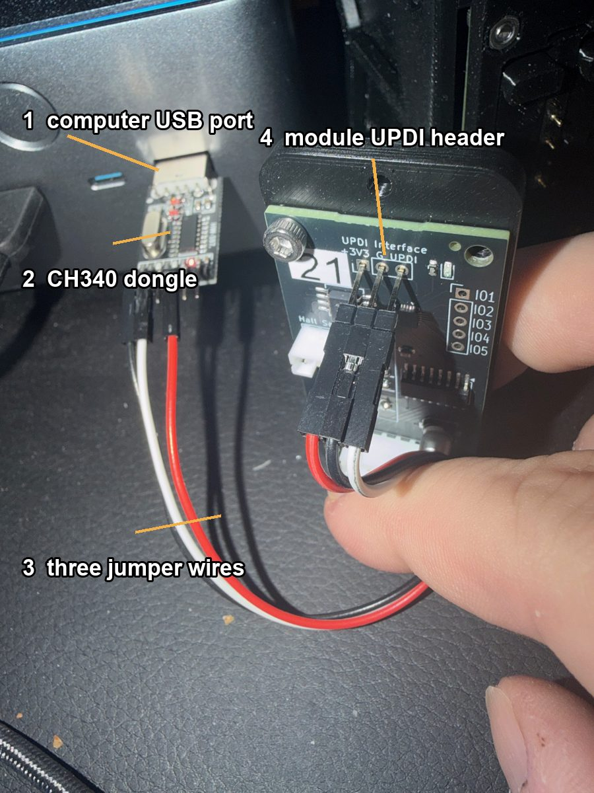
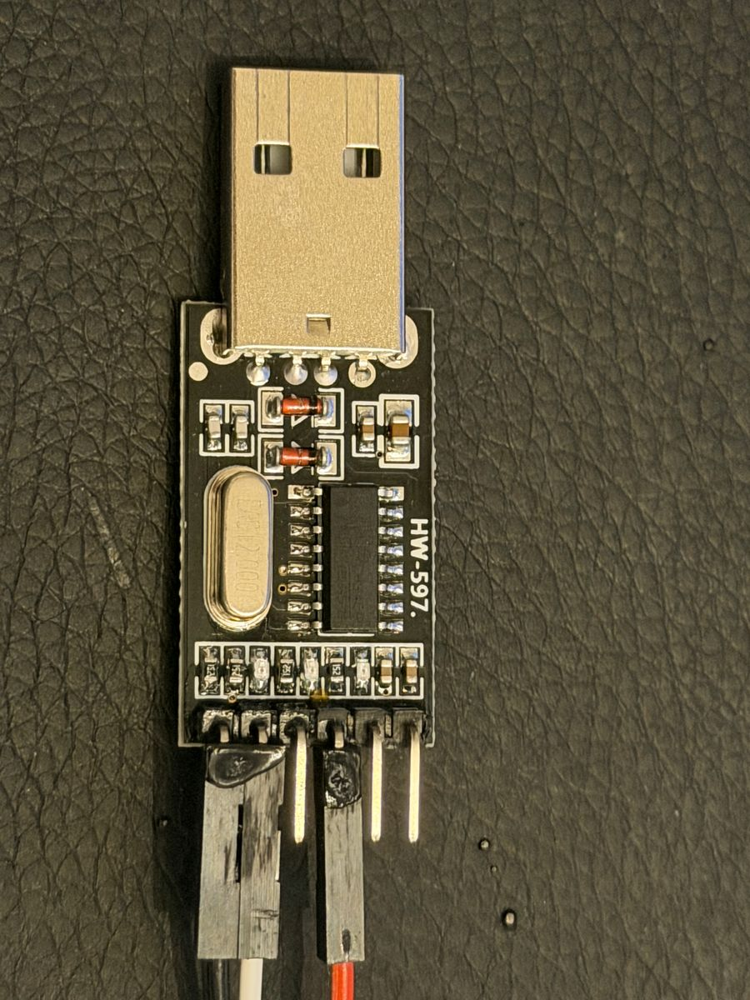
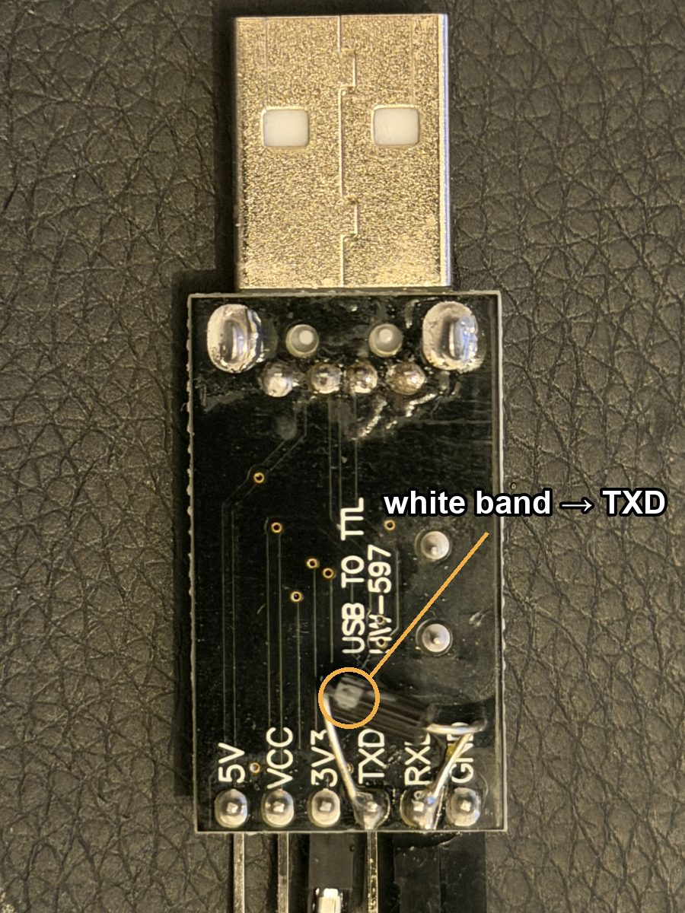
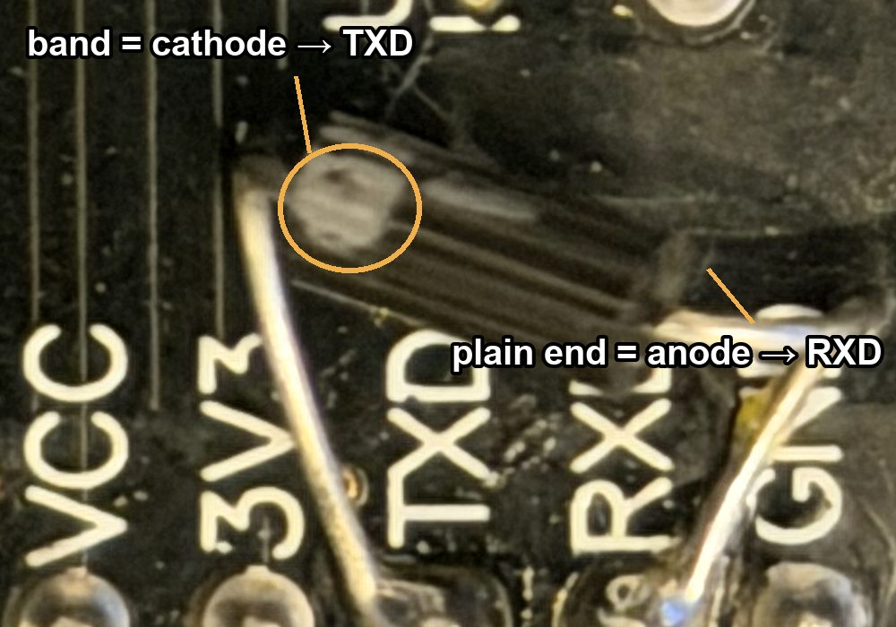

# Building a UPDI flasher from a USB-to-serial adapter

The split-flap modules use an ATtiny1616, which is programmed over **UPDI**, a single-wire interface. You do not need a dedicated programmer: a cheap CH340 USB-to-TTL adapter with **one Schottky diode** soldered across two of its pins does the whole job. This page shows the build and explains why the diode has to point one particular way.

The only tool you need is a soldering iron.

## Parts

| Part | Notes |
|---|---|
| [HiLetgo CH340 USB-to-TTL adapter](https://www.amazon.com/dp/B00LZV1G6K) | Sold as a 5-pack. Board marking `HW-597`, six-pin header `5V VCC 3V3 TXD RXD GND`. Any CH340, CP2102 or FTDI adapter with the same pins works the same way. |
| [1N5817 Schottky diode](https://www.amazon.com/dp/B07Q5H1SLY) | Any small **Schottky** diode does the job (1N5817, 1N5819, BAT85). |
| 3 jumper wires | **Female-to-male.** The female end plugs onto the adapter's header pins; the male end pushes into the holes of the module's UPDI header. They carry `3V3`, `GND` and the UPDI line. |
| Soldering iron | For the one solder joint pair below. |

## The full chain



Computer → CH340 adapter in a USB port → three female-to-male jumper wires (female end on the adapter, male end pushed into the module) → the module's `UPDI Interface` header, which is labelled `+3V3`, `G` and `UPDI`. The adapter powers the module's controller through the `3V3` wire while it is being flashed, so on the bench the module needs no other supply.

## The adapter

<p>


</p>

**Left, component side.** Nothing here is modified. The jumper wires on the header run to the module.

**Right, solder side.** The one modification: a diode soldered between the `TXD` and `RXD` pads, with its **white band at the `TXD` end**. That band is the whole point of this page.

## Why one wire needs a diode

A serial adapter has two data pins: `TXD` talks, `RXD` listens. UPDI has one wire, and both the programmer and the chip talk on it, taking turns. So the adapter's two pins have to be joined into one line.

The ATtiny drives the UPDI line the polite way: it only ever **pulls the line low**, and when it lets go an internal pull-up floats the line back high. The adapter's `TXD` pin is not polite. It actively drives the line **high** whenever it is idle, which is most of the time. Tie `TXD` straight to the UPDI pin and the moment the chip tries to answer by pulling the line low, it is fighting the adapter's output. The answer is swamped and nothing works.

The diode turns `TXD` into a polite driver. With the diode's cathode on `TXD`, current can only flow *into* `TXD`: when `TXD` goes low it pulls the shared line down through the diode, but when `TXD` goes high the diode blocks and `TXD` is effectively disconnected. The chip's pull-up holds the line high, and the chip can pull it low with nothing fighting back. `RXD` sits on the shared line the whole time, so the adapter hears everything.

```
  CH340 adapter                                    module UPDI header

  TXD ───────|<───────┐
        band on the   │
        TXD end       ├──────────────────────────  UPDI   (pull-up inside the chip;
  RXD ────────────────┘                                    the chip only pulls low)

  3V3 ─────────────────────────────────────────── +3V3
  GND ─────────────────────────────────────────── G
```

Only `RXD` goes to the module's `UPDI` pin. Nothing connects to `TXD` except the diode.

## Diodes are directional

A resistor does not care which way round it goes. A diode does; that is its entire job. It has two ends, an **anode** and a **cathode**, and it lets current flow from anode to cathode while blocking the other way. On the schematic symbol the arrow points from anode to cathode, and the bar at the arrow's tip is the cathode.

On the physical part the cathode is marked by a **band** printed on one end of the body. On the 1N5817 it is a white band on a black body. That band is the only thing telling you which way the diode faces, so before you solder, find it.

> ### Solder the diode so the band is at the `TXD` pad.
> Cathode (the banded end) to `TXD`. Anode (the plain end) to `RXD`.



**If you get it backwards** the adapter can push the line high but can never pull it low, so the chip never hears a single bit and avrdude stops with `UPDI link initialization failed`. Nothing is damaged. Desolder the diode, turn it around, and solder it again.

## Soldering it

1. Flip the adapter over. On the `HW-597` the pads are labelled on the solder side, so you can read `TXD` and `RXD` directly.
2. Find the band on the diode. Bend the leads so the diode lies across the two pads with the **band end over `TXD`**.
3. Tin both pads. Solder the band lead to `TXD`, then the plain lead to `RXD`. Trim the leads short so the diode lies flat.
4. Check that no solder bridges to the neighbouring `3V3` or `GND` pads.

## Wiring it to a module

| Adapter pin | Module header pin | Purpose |
|---|---|---|
| `3V3` | `+3V3` | Powers the module's controller while flashing. |
| `GND` | `G` | Common ground. |
| `RXD` | `UPDI` | The shared data line. |
| `TXD` | nothing | Only the diode connects here. |

## Flashing

`platformio.ini` in this repository already selects this programmer; only the port name needs to match your adapter:

```ini
upload_protocol = serialupdi
upload_port     = /dev/cu.usbserial-XXXX
upload_speed    = 57600
```

Write the fuses once per chip, then upload:

```
pio run -t fuses
pio run -t upload
```

See [SETUP.md](SETUP.md) for the full toolchain walkthrough. No PlatformIO? [FLASHING.md](FLASHING.md) does the same two steps with avrdude alone and the prebuilt `firmware.hex` from the latest release.

### If it says `UPDI link initialization failed`

- **Check all three wires** are seated at both ends. Without the `3V3` wire the module has no power and cannot answer.
- **Give it a moment** and try again. Some modules answer only a few seconds after being connected.
- **Diode direction.** The band must be at the `TXD` pad. If it is at `RXD`, turn it around.
- **Try a slower speed.** Set `upload_speed = 28800`.
